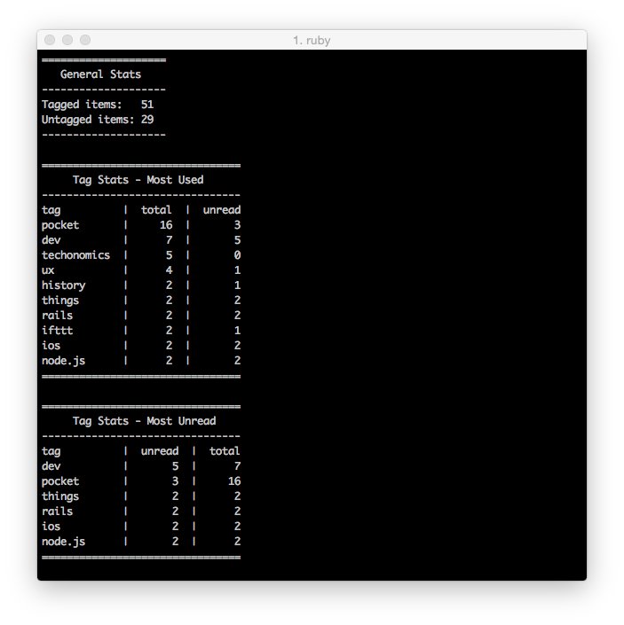

# ruPocket

Current phase: PocketTags - Stats for Pocket Tags

We use [Pocket](http://getpocket.com), we need stats for our Tags on Pocket.

This project uses [pocket-ruby](https://github.com/turadg/pocket-ruby).

Thanks to [alexchee](https://github.com/alexchee), author of [pocket-api](https://github.com/alexchee/pocket_api). He advise me about **pocket-ruby**.

**app.rb** is based on demo-server.rb from **pocket-ruby**

## Run script

    ruby app.rb

## Generate stats

    open http://localhost:4567/tags

## Use cached data to generate stats

    open http://localhost:4567/tags-cache

## Where my stats are?

    Stats are printed to the console

## In console you will get your stats, like this...

## I think that stats are wrong

    # Try to process more saved items.
    # Increment count parameter to 100, for instance.
    # :count => 100
    info = client.retrieve(:detailType => :complete, :count => 100)
